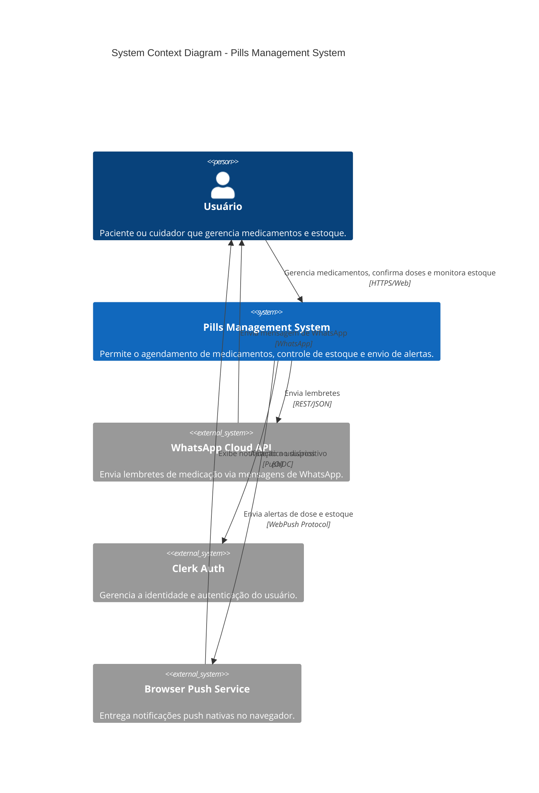
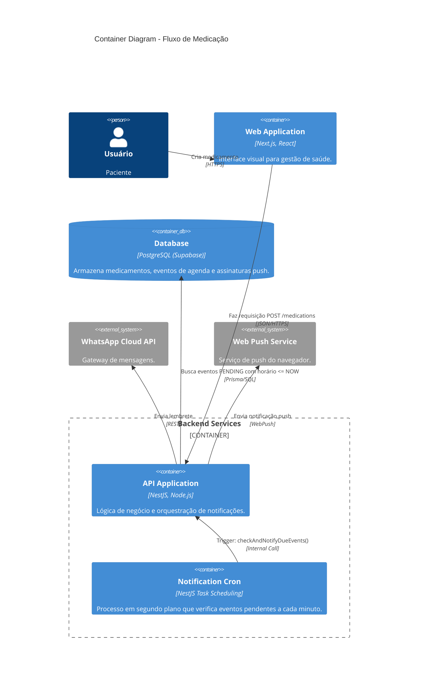
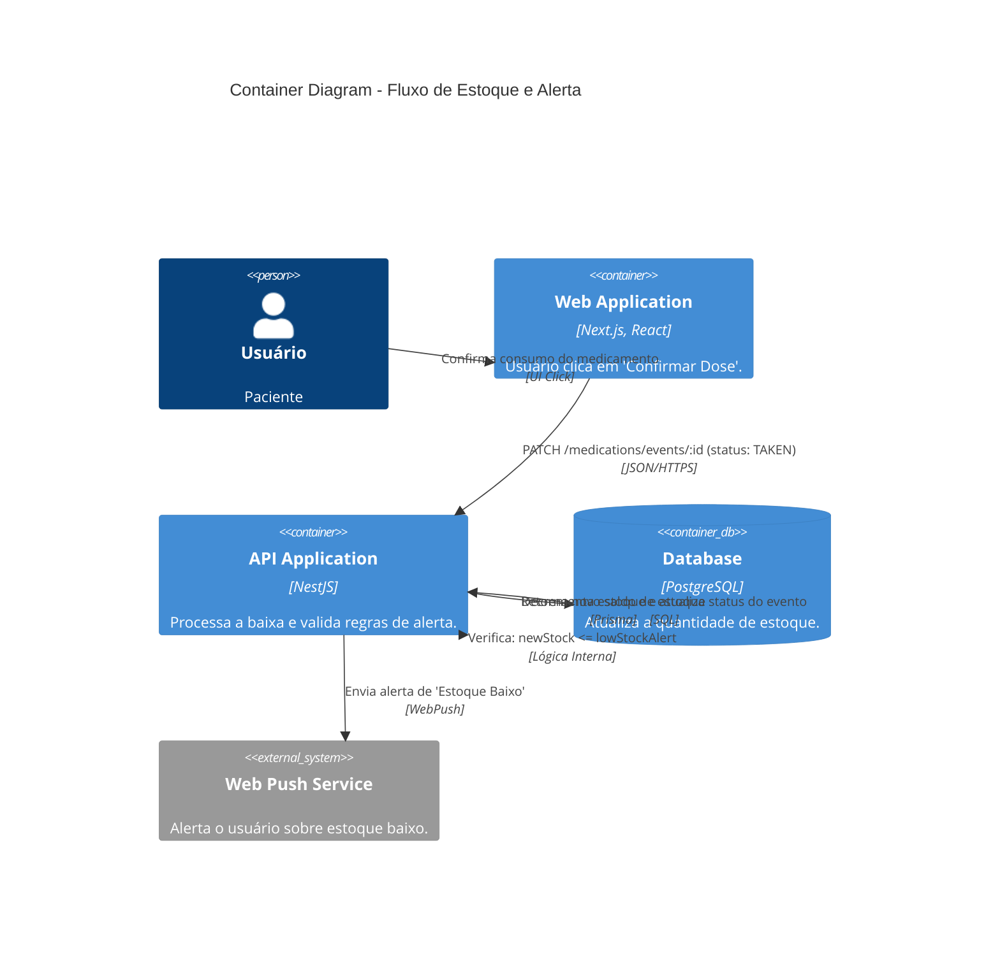

# C4 Architecture Model - Pills Management System

Este documento descreve a arquitetura do sistema **Pills** utilizando o modelo C4, focando nos fluxos de criação de medicamentos, agendamentos, notificações e gestão de estoque.

## 1. System Context Diagram (Nível 1)

O diagrama de contexto mostra como o usuário interage com o sistema e como o sistema se integra com provedores externos de comunicação e autenticação.

---

## 2. Container Diagram (Nível 2)

O diagrama de containers detalha as aplicações internas e como os dados fluem para os casos de uso específicos.

### Fluxo A: Criação de Medicamento e Notificação
Este fluxo cobre desde o cadastro do medicamento até o envio do lembrete agendado.

### Fluxo B: Criação (Atualização) de Estoque e Notificação
Este fluxo ocorre quando o usuário confirma o consumo de um medicamento, disparando a baixa no estoque e o alerta de reposição.

## Resumo dos Fluxos

| Fluxo | Trigger | Ação Principal | Resultado |
| :--- | :--- | :--- | :--- |
| **Medicamento** | Cadastro via UI | `generateSchedule()` no Backend | Inserção de múltiplos registros na tabela `MedicationEvent`. |
| **Notificação** | Cron (1m) | `checkAndNotifyDueEvents()` | Envio de mensagens via WhatsApp e Push. |
| **Estoque** | Confirmação de Dose | `updateEventStatus()` (decremento) | Atualização da coluna `stock` e possível trigger de `sendLowStockAlert()`. |
